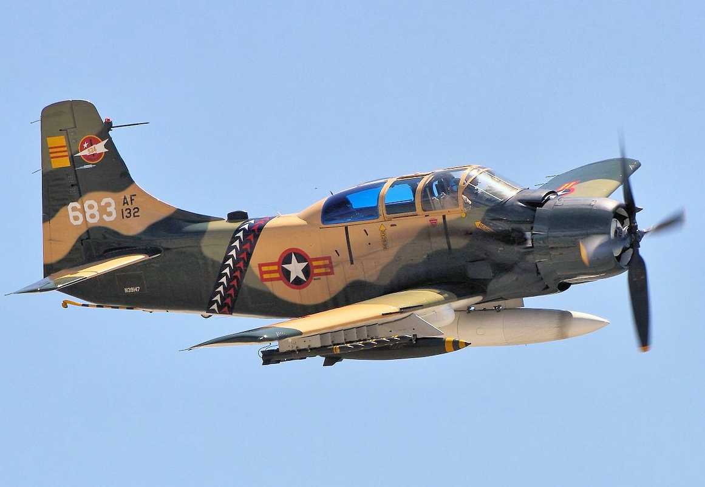
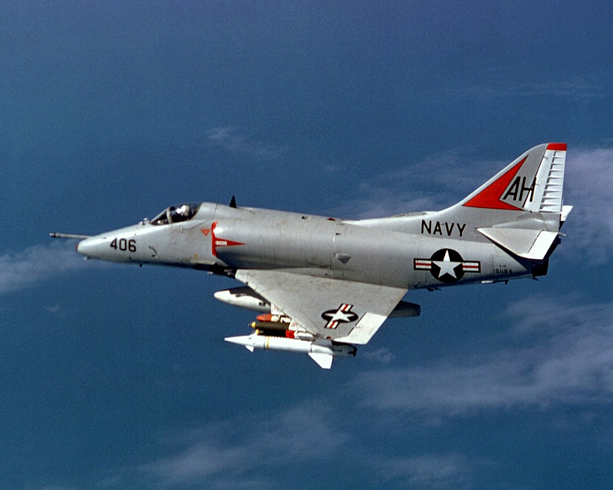
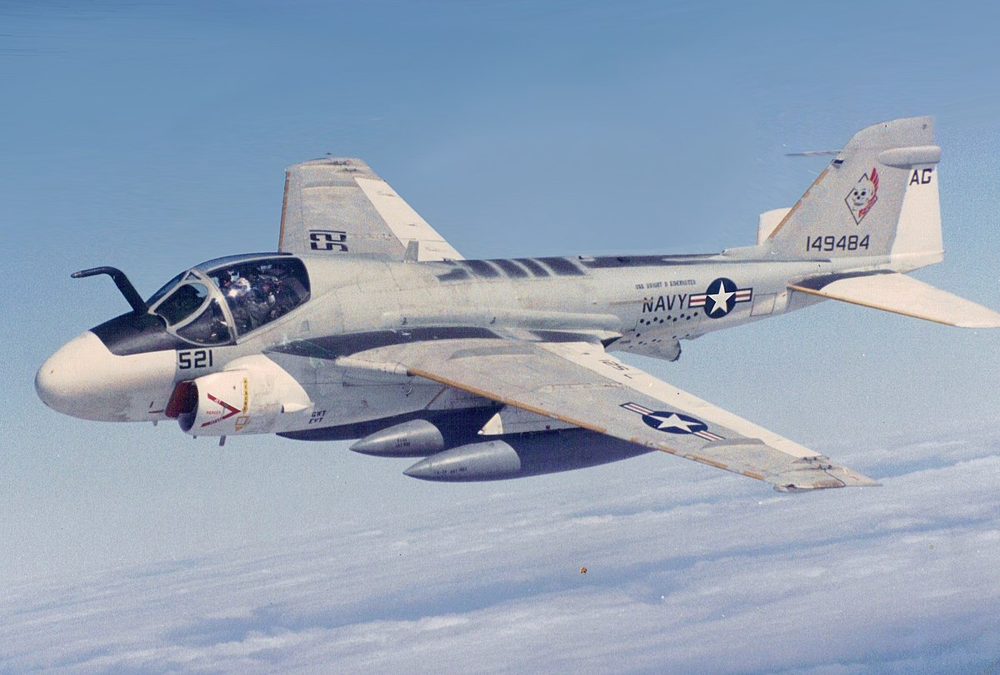
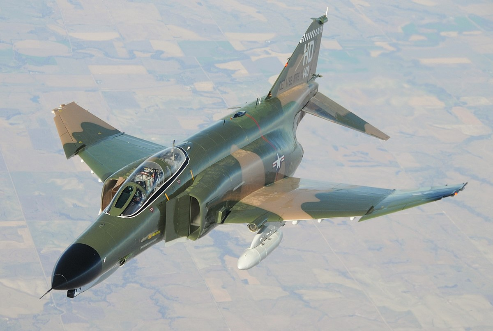
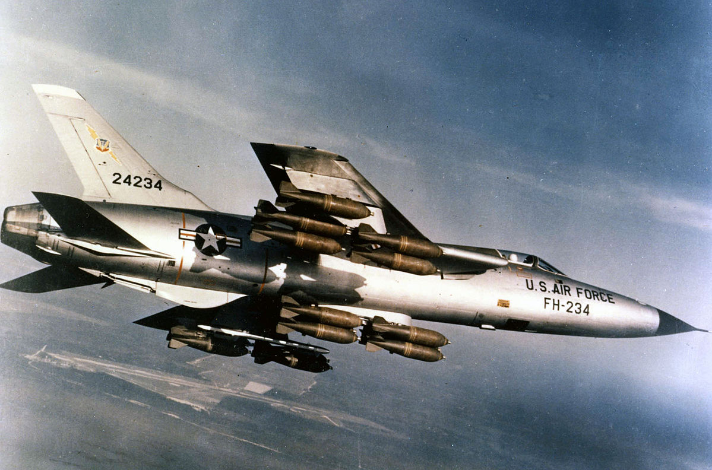

```{r setup, include=FALSE, echo=FALSE}
source("config/config_pj.R")
knitr::opts_chunk$set(echo = F, include = T)

```

Rolling Thunder is an interesting operation to investigate, because the bombing strategy changes over time. It was meant to "send a warning message" to the North, but it was not successful at what it set out to do.


# Background

```{r}
thunder = fread("data/processed/bombing_rolling_thunder.csv")
vnmap = readRDS("data/raw/vnmap.rds")
north_map = readRDS("data/raw/north_map.rds")
aircrafts = fread("data/raw/THOR_Vietnam_Aircraft_Glossary.csv")
target_types = fread("data/interim/target_types.csv")
thunder = thunder[msnym <= "1968-11-02"]

replace_missing(thunder)
thunder[, msndate := ymd(msndate)]
thunder[, msnym := ymd(msnym)]
thunder[, delivered_tonnage := weapontypeweight * numweaponsdelivered * 0.453592 / 1000]
thunder[, jettisoned_tonnage := weapontypeweight * numweaponsjettisoned * 0.453592 / 1000]
thunder[, returned_tonnage := weapontypeweight * numweaponsreturned * 0.453592 / 1000]

thunder = merge(thunder, target_types, on = "tgt_type", how = "left")

```

After Geneva conference in 1954, the U.S. replaced France as a political backup for Ngo Dinh Diem in the South Vietnam. They believed in the "domino effect", which suggested that if Vietnam fell under the influence of communism, all countries around would follow. At first, the U.S. believed South Vietnam's government could be grown into a self-sustained one. However, by the beginning of 1965, that belief was turned into the realization that without further American action, Saigon government could not survive. 

Operation Rolling Thunder was devised as a demonstration of such commitment to Saigon. Officially it lasted from 1965-03-02 to 1968-11-02 with three main objectives which evolved over time:

- To boost Saigon's morale at first while not directly and severely affect Hanoi. 
- To persuade North Vietnam to stop supporting the South's communists withouth sending ground force into the North
- To destroy North Vietnam's transport system, industrial base, air defenses, which, in effect, will cut off the supporting line from North to South.

In other words, the U.S. wanted to scare North Vietnam off the South, but they did not dare to go for a full-blown air campaign lest China or Soviet would retaliate with their full might. Therefore, their bombing strategy slowly escalated and changed over time, which would reflect to the data.


# Overview

As shared above, the operation started from beginning of 1965. However, we only have data from October of the same year. During this operation, a total of `r sum(thunder$delivered_tonnage) %>% comma()` tons of weapons were dropped on Vietnam.


```{r}

north_center = c(105.5, 20)
# north_map <- ggmap(get_googlemap(center = north_center, scale = 2, zoom = 6, maptype = "roadmap"), extent = "normal")

target_coord <- thunder[mfunc_desc_class == "KINETIC", .(msnyear, mfunc_desc_class, 
                            lon = tgt_lon, 
                            lat = tgt_lat, 
                            milservice)] %>% unique()

force_col = c(
    "USAF" = "dodgerblue4"
    , "USN" = "darkgoldenrod3"
    , "USMC" = "red3"
    , "VNAF" = "royalblue3"
    , "RLAF" = "gray"
    , "RAAF" = "gray"
    , "KAF" = "gray"
    , "USA" = "gray"
)

```


To minimize airspace conflict among air forces, North Vietnam was divided into six target regions called "route packages" (RP).


<center>  </center>


Each region was assigned to one air force or navy, and they were forbidden to intrude each others' regions. The Navy's Carrier Task Force 77 handled operations in RP 2, 3, 4, and 6B, as these bordered on the Gulf of Tonkin. The Air Force was given RP 1, RP 5, and 6A. We can see this division clearly from the bombing targets:

```{r, include=TRUE, fig.height=8, fig.width=8, fig.align="center"}
nsample = 5000
edges = round(north_map$data)
    grid_x = seq(edges$lon[1], edges$lon[2], 1)
    grid_y = seq(edges$lat[1], edges$lat[3], 1)
    
target_df <- target_coord %>% 
    filter(
        # mfunc_desc_class == "KINETIC"
        msnyear >= 1966
        , lon >= edges$lon[1],  lon <= edges$lon[2]
        , lat >= edges$lat[1], lat <= edges$lat[3]
        , milservice %in% c("USN", "USAF")
    ) %>% 
    sample_n(nsample)    

label_df = data.table(
    x = c(107.5, 109)
    , y = c(19, 17)
    , label = c("US Navy", "US Air Force")
)

thunder_map = north_map +
    geom_point(data = target_df, aes(x = lon, y = lat, col = milservice), size = 0.1, show.legend = F) +
    geom_vline(xintercept = grid_x, size = 0.1, alpha = 0.7, color = "gray") +
    geom_hline(yintercept = grid_y, size = 0.1, alpha = 0.7, color = "gray") + 
    geom_label(data = label_df[1], aes(x = x, y = y, label = label), col = "white", fill = force_col["USN"]) +
    geom_label(data = label_df[2], aes(x = x, y = y, label = label), col = "white", fill = force_col["USAF"]) +
    scale_color_manual(values = force_col, name = NULL) +
    scale_x_continuous(breaks = grid_x) + 
    scale_y_continuous(breaks = grid_y) + 
    labs(title = "Rolling Thunder bombing map 1965 - 1968", subtitle = sprintf("N sample: %s", nsample)) +
    labs(x = "", y = "") + 
    theme(
        panel.background = element_blank()
        , axis.ticks = element_blank()
        , axis.line = element_line(size = 0.1, color = "gray")
        , axis.text = element_text(color = "gray50")
        
    )

print(thunder_map)

```


# Evolution of bombing targets

```{r}
# ggplot(thunder[!is.na(tgt_lat) & tgt_lat >= 10]) + 
#     geom_boxplot(aes(x = factor(msnyear), y = tgt_lat))
```

```{r}
# ggplot(thunder[!is.na(tgt_lat) & tgt_lon >= 100 & tgt_lon <= 110]) + 
#     geom_boxplot(aes(x = factor(msnyear), y = tgt_lon))

```


At the beginning of the operation, Washington believed in "gradualism", which considered "the threat of destruction is a better signal of U.S.' determination than the destruction itself". This translated into the the U.S. strategy to "hold important target hostage by bombing trivial ones". Johnson tightly control the campaign, refused to attack Hai Phong port directly and he deemed it "too provocative". 

We can see this initial hesitation clearly when looking at bombing map of 1965:

```{r, include=TRUE, fig.height=7, fig.width=14, fig.align="center"}
point_65 = plot_bomb_points(north_map, target_coord, 1965, nsample = 2000, plot_title = "Rolling Thunder target map - 1965") + 
    annotate("point", x = 106.3, y = 20.8, alpha = 0.2, size = 19)

dense_65 = plot_bomb_density(north_map, target_coord, 1965, nsample = 2000, plot_title = "Rolling Thunder bombing intensity - 1965") + 
    annotate("label", x = 108, y = 21, label = "Hanoi & Hai Phong\nwere spared", hjust = 0, alpha = 0.8) 

grid.arrange(point_65, dense_65, nrow = 1)
```

According to air force historian Earl Tilford:

> "(Initially) Targeting bore little resemblance to reality in that the sequence of attacks was uncoordinated and the targets were approved randomly – even illogically. The North's airfields, which, according to any rational targeting policy, should have been hit first in the campaign, were also off-limits."

This course of action angered the military generals. They were disatisfied with the ranndomness and uselessness of the targets, and complained that striking and re-striking some targets benefited the North Vietnam's defense force. Thanks to the repetiveness of targets, Vietnamese gunners got time to adapt to U.S. patterns and incured heavy lost on its air forces. To calm these concerns, from mid 1966 to 1967 President Johnson approved attacks on sensitive targets, especially targets in Hanoi and Hai Phong. 

```{r, fig.height=7, fig.width=14, fig.align="center", include=TRUE}
dense_66 = plot_bomb_density(north_map, target_coord, 1966, nsample = 2000, plot_title = "Rolling Thunder bombing intensity - 1966")
dense_67 = plot_bomb_density(north_map, target_coord, 1967, nsample = 2000, plot_title = "Rolling Thunder bombing intensity - 1967") + 
    annotate("label", x = 108, y = 21, label = "Hanoi & Hai Phong\nwere targeted this year", hjust = 0, alpha = 0.8) 
grid.arrange(dense_66, dense_67, nrow = 1)
```

In 1968, Rolling Thunder reached its final stage of operational evolution. Its purpose transformed from psychological warfare in the higher route packages to that of interdicting the logistics flow from the North to the South. In the following map, we can see most of the targets were in the the "pan-handle" area, with Ha Tinh suffered the most from the U.S. escalated bombing efforts.

```{r, fig.height=8, fig.width=8, fig.align="center", include=TRUE}
plot_bomb_density(north_map, target_coord, 1968, nsample = 2000, plot_title = "Rolling Thunder bombing intensity - 1968") + 
    annotate("label", x = 106.7, y = 19, 
             label = "Ha Tinh were dubbed Vietnam's \n\"frying pan and bomb crater\"", hjust = 0, alpha = 0.8) 

```

Let's look at the change of U.S. bombing priorities throughout the years again:

```{r, fig.height=7, fig.width=7, fig.align="center", include=TRUE, warning=FALSE, message=FALSE}

label_df = data.table(
    x = 108
    , y = 19.5
    , msnyear = unique(target_df$msnyear)
)

nsample_year = 2000
edges = round(north_map$data)
grid_x = seq(edges$lon[1], edges$lon[2], 1)
grid_y = seq(edges$lat[1], edges$lat[3], 1)
    
target_df2 <- target_coord %>% 
    filter(
        mfunc_desc_class == "KINETIC"
        , msnyear >= 1965
        , lon >= edges$lon[1],  lon <= edges$lon[2]
        , lat >= edges$lat[1], lat <= edges$lat[3]
        # , milservice %in% c("USN", "USAF")
    ) %>% 
    group_by(msnyear) %>% 
    do(sample_n(., nsample_year))

label_df = data.table(
    x = 108
    , y = 19.5
    , msnyear = unique(target_df2$msnyear)
)


thunder_map_year = north_map +
    geom_density_2d(data = target_df2, aes(x = lon, y = lat), size = 0.3) +
    stat_density_2d(data = target_df2, aes(x = lon, y = lat, fill = ..level.., alpha = ..level..), show.legend = F, geom = "polygon") +
    geom_label(data = label_df, aes(x = x, y = y, label = msnyear), col = "gray40", size = 10) + 
    geom_vline(xintercept = grid_x, size = 0.1, alpha = 0.7, color = "gray") +
    geom_hline(yintercept = grid_y, size = 0.1, alpha = 0.7, color = "gray") +
    scale_x_continuous(breaks = grid_x) +
    scale_y_continuous(breaks = grid_y) +
    scale_alpha(guide = F) + 
    scale_fill_distiller(palette = "Spectral") + 
    labs(x = "", y = "", title = "Rolling Thunder bombing intensity throughout the years") + 
    transition_manual(frames = msnyear) +
    ease_aes("linear") +
    theme(
        panel.background = element_blank()
        , axis.ticks = element_blank()
        , axis.line = element_line(size = 0.1, color = "gray")
        , axis.text = element_text(size = 15, color = "gray50")
        , title = element_text(size = 16)
    )

thunder_map_year
thunder_map_animated = animate(thunder_map_year, width = 800, height = 800)
thunder_map_animated
# anim_save("thunder_map_animated.gif", thunder_map_animated, path = "plot/")
```


# Details on bombing strategies

Bombing tonnage in increased gradually year-by-year and peaked in 1968, which is why it was described as the bloodiest year in this war.

```{r, fig.width=8, fig.height=5, fig.align="center"}
theme_clean = theme(
    panel.background = element_blank()
    , panel.grid.major.x = element_blank()
    , panel.grid.major.y = element_line(color = "gray90", size = .3)
    , axis.ticks = element_blank()
    , axis.text = element_text(color = "gray40")
    , axis.line = element_line(color = "gray80", size = 0.3)
    , axis.title.x = element_text(color = "gray40", hjust = 0)
    , axis.title.y = element_text(color = "gray40", hjust = 1)
    , title = element_text(color = "gray40")
)

theme_clean_flip = theme_clean + 
    theme(
        panel.grid.major.x = element_line(color = "gray90", size = 0.2)
        , panel.grid.major.y = element_blank()
    )

time_axis = scale_x_date(
    breaks = seq(date("1966-01-01"), date("1969-01-01"), by = "6 month"), 
    limits = c(date("1965-09-01"), date("1969-01-01")), 
    date_labels = "%Y-%m")

tonnage_time = thunder[, .(total_tonnage = sum(delivered_tonnage)), by = .(msnym)]
tonnage_time[, highlight := msnym >= "1968-01-01"]

hlcol = c("TRUE" = "firebrick3", "FALSE" = "gray80")
hlsize = c("TRUE" = 1, "FALSE" = 0.5)

ggplot(tonnage_time) + 
    geom_line(aes(x = msnym, y = total_tonnage, group = 1, col = highlight, size = highlight), show.legend = F) + 
    annotate("text", x = date("1968-05-01"), y = 23000
             , label = "1968 was the bloodiest year of the war"
             , hjust = 1, size = 4.5, color = "gray30") + 
    scale_color_manual(values = hlcol) + 
    scale_size_manual(values = hlsize) + 
    labs(x = "", y = "", title = "Bombing tonnage over months", subtitle = "Unit: ton") + 
    scale_y_continuous(labels = comma_format()) + 
    time_axis +
    theme_clean

```

The increase in intensity also reflects in the tonnage over area. To calculate the bombing area, we get the degrees at 10th and 90th percentiles of their distribution, calculate the differences in degrees and convert it to kilometers. For simplification, let the range of one latitude / longitude equals to 111km.

With this calculation, we can see during the peak bombing time of 1968, each square kilometer received more than three times the amount of weapon in the previous peaks. This was due to the increase in bombing tonnage, and the higher focus on specific areas.

```{r, fig.height=5, fig.width=8, fig.align="center"}
month_aggr = thunder[, .(
    total_tonnage = sum(delivered_tonnage)
    , q1_lat = quantile(tgt_lat, 0.1, na.rm = T)
    , q3_lat = quantile(tgt_lat, 0.9, na.rm = T)
    , q1_lon = quantile(tgt_lon, 0.1, na.rm = T)
    , q3_lon = quantile(tgt_lon, 0.9, na.rm = T)
    
    ), by = .(msnyear, msnym)]

month_aggr[, area := abs((q1_lat - q3_lat) * (q1_lon - q3_lon) * 111 ^ 2)]
month_aggr[, kg_per_km2 := total_tonnage / area * 1000]
month_aggr[msnyear <= 1967, `:=`(group = date("1967-01-01"), highlight = F)]
month_aggr[msnyear == 1968, `:=`(group = date("1968-07-01"), highlight = T)]

year_aggr = month_aggr[, .(avg_monthly = mean(kg_per_km2)), by = .(group, highlight)]
year_aggr[, x := group - months(6)]
year_aggr[, xend := group + months(6)]

ggplot(month_aggr) +
    geom_line(aes(x = msnym, y = kg_per_km2, 
                  color = highlight, size = highlight, group = 1), show.legend = F) +
    geom_segment(data = year_aggr, 
                 aes(x = x, xend = xend, y = avg_monthly, yend = avg_monthly, 
                     color = highlight), show.legend = F) +
    geom_label(data = year_aggr, aes(x = group, y = avg_monthly, label = round(avg_monthly, 1)), color = "gray40") + 
    annotate("text", x = date("1968-05-01"), y = 800
             , label = "Average monthly mass in 1968 was about\n3 times the average of 1966 and 1967"
             , hjust = 1, size = 4.5, color = "gray30") + 
    labs(x = "", y = "", title = "Average bombing mass per km2 - monthly figures", subtitle = "Unit: kg/km2") + 
    scale_color_manual(values = hlcol) +
    scale_size_manual(values = hlsize) +
    time_axis +
    theme_clean

```

Most of the sorties are related to Strike and Armed reconnaissance missions. 

```{r, fig.height=5, fig.width=8, fig.align="center"}
mfunc_aggr = thunder[!is.na(mfunc_desc), .(
    sortie_count = .N
    , mission_count = uniqueN(missionid)
    , total_tonnage = sum(delivered_tonnage)
), by = .(mfunc_desc, mfunc_desc_class)][order(-mission_count)]

mfunc_aggr[, highlight := mfunc_desc %in% c("ARMED RECCE", "STRIKE")]
hlcol2 = c("TRUE"= "dodgerblue4", "FALSE" = "gray80")

ggplot(mfunc_aggr[1:10]) + 
    geom_bar(aes(x = reorder(mfunc_desc, mission_count), y = mission_count, fill = highlight), 
             stat = "identity", show.legend = F) +
    geom_text(data = mfunc_aggr[1:2], 
              aes(x = reorder(mfunc_desc, mission_count), y = mission_count, label = comma(mission_count)), 
              color = "white", hjust = 1.2) +
    labs(x = "", y = "", title = "Number of mission by function") + 
    scale_y_continuous(labels = comma_format()) + 
    scale_fill_manual(values = hlcol) + 
    coord_flip() + 
    theme_clean_flip  
    

```

During 1966 there was a huge spike in the number of armed recon missions. This was most likely the result of military's complaints about the faulty system to request fixed targets. As summed up by [this post on Quora](https://www.quora.com/What-was-the-purpose-of-and-problems-with-the-Rolling-Thunder-bombing-campaign-during-the-Vietnam-War/answer/Charles-Fletcher-5), it took too much time for the Air Force and Navy to request and get approvals to attack a target. By the time the target was approved, it had already moved or became trivial.

```{r, fig.height=8, fig.height=5, fig.align="center"}
mfunc_time = thunder[, .(
    sortie_count = .N
    , mission_count = uniqueN(missionid)
    , total_delivered = sum(delivered_tonnage)
), by = .(mfunc_desc, msnym, msnyear)]

mfunc_time[, highlight := msnyear == 1966]
mfunc_time[, mfunc_highlight := interaction(mfunc_desc, highlight)]

hlcol2 = c("ARMED RECCE" = "goldenrod3", "STRIKE" = "firebrick3")
hlsize2 = c("TRUE" = 1, "FALSE" = 0.5)
hlalpha2 = c("TRUE" = 1, "FALSE" = 0.4)

ggplot(mfunc_time[mfunc_desc %in% c("STRIKE", "ARMED RECCE")]) + 
    geom_line(aes(x = msnym, y = mission_count, 
                  color = mfunc_desc, size = highlight, alpha = highlight, group = mfunc_desc)
             , stat = "identity") +
    scale_color_manual(values = hlcol2) + 
    scale_size_manual(values = hlsize2) + 
    scale_alpha_manual(values = hlalpha2) +
    scale_y_continuous(labels = comma_format()) +
    labs(x = "", y = "", title = "Number of Armed Recon and Strike missions over months") + 
    time_axis + 
    theme_clean + 
    guides(size = F, alpha = F) + 
    theme(
        legend.position = c(0.14, 0.97)
        , legend.direction = "horizontal"
        , legend.title = element_blank()
        , legend.key = element_blank()
        , legend.background = element_blank()
        , legend.box.background = element_blank()
        , legend.text = element_text(color = "gray40")
    )

```

Looking at the target types of these missions we can further understand their functionalities. While targets of Strike missions were fixed, Armed recon missions' targets are more likely to be moving (like vehicles). This type of mission made use of small aircraft formations to patroll highways, railroads, rivers and bombed whatever they deemed a good target. 

```{r, fig.height=5, fig.width=8}
target_mfunc_time = thunder[!is.na(tgttype), .(
    sortie_count = .N
    , total_delivered = sum(delivered_tonnage)
), by = .(tgt_type_group, mfunc_desc, msnyear)]

target_mfunc_time[, year_delivered := sum(total_delivered), by = .(msnyear, mfunc_desc)]
target_mfunc_time[, delivered_pct := total_delivered / year_delivered]
target_type_68 = thunder[msnyear == 1968, .(total_delivered_68 = sum(delivered_tonnage)), by = .(tgt_type_group)]

target_mfunc_time = merge(target_mfunc_time, target_type_68, on = "tgt_type_group", all.x = T)
target_mfunc_time[, tgt_type_group := reorder(tgt_type_group, total_delivered_68)]

target_mfunc_time = target_mfunc_time[order(msnyear, mfunc_desc, delivered_pct)]
# target_mfunc_time[, pos := cumsum(delivered_pct), by = .(msnyear, mfunc_desc)]

tgt_group_col = c(
    "Transport route" = "gray90"
    , "Vehicles" = "goldenrod4"
    , "Weapons" = "goldenrod3"
    , "Military facilities" = "goldenrod2"
    , "Civilian facilities" = "gray90"
    , "Transport station" = "gray90"
    , "Others" = "gray90"
    , "Military personnel" = "gray90"
    , "Military equipments" = "gray90"
    , "POL" = "gray90"
)

target_mfunc_time[tgt_type_group %in% c("Vehicles", "Weapons", "Military facilities") & 
                      delivered_pct > 0.05, text_show := "show"]
target_mfunc_time[is.na(text_show), text_show := "hide"]

text_alpha = c("show" = 1, "hide" = 0)


ggplot(target_mfunc_time[mfunc_desc %in% c("ARMED RECCE", "STRIKE")], 
       aes(x = factor(msnyear), y = delivered_pct, fill = tgt_type_group, alpha = text_show)) + 
    geom_bar(stat = "identity", position = position_stack(), alpha = 1) + 
    geom_text(aes(label = percent(delivered_pct)),
              color = "white", position = position_stack(vjust = 0.5)) +
    labs(x = "", y = "", title = "Tonnage percentage on target types", 
         caption = "A large portion of bomb in armed recon missions were spent to destroy vehicles") +
    scale_fill_manual(values = tgt_group_col, name = "Target type groups") + 
    scale_alpha_manual(values = text_alpha) +
    guides(alpha=F) +
    scale_y_continuous(labels = percent_format()) + 
    facet_wrap(~mfunc_desc) +
    theme_clean + 
    theme(
        panel.grid.major.y = element_blank()
        , strip.background = element_rect(fill = "transparent", color = "gray80")
        , strip.text = element_text(color = "gray30")
        , plot.caption = element_text(hjust = 0)
    )


```


Which aircrafts were used in these types of mission?

```{r, fig.width=10, fig.height=6, fig.align="center"}
aircraft_mfunc = thunder[!is.na(aircraft_application) & (mfunc_desc_class == "KINETIC"), .(
    sortie_count = .N
    , mission_count = uniqueN(missionid)
    , total_tonnage = sum(delivered_tonnage)
), by = .(mfunc_desc, aircraft_root)][order(mfunc_desc, -mission_count)]

aircraft_mfunc[, msn_ranking := rank(-mission_count), by = .(mfunc_desc)]
aircraft_mfunc[, sortie_ranking := rank(-sortie_count), by = .(mfunc_desc)]

# selected_ac = c("A4", "F4", "A1", "A6", "F105")
selected_ac = aircraft_mfunc[sortie_count >= 10000]$aircraft_root
aircraft_mfunc[mfunc_desc == "ARMED RECCE", highlight := "hl1"]
aircraft_mfunc[mfunc_desc == "STRIKE", highlight := "hl2"]
aircraft_mfunc[!(aircraft_root %in% selected_ac), highlight := "hl3"]

hlcol3 = c("hl1" = "goldenrod3", "hl2" = "firebrick3", "hl3" = "gray80")

ggplot(aircraft_mfunc[mfunc_desc %in% c("ARMED RECCE", "STRIKE") & sortie_ranking <= 10]) + 
    geom_bar(aes(x = reorder(aircraft_root, sortie_count), y = sortie_count, 
                 fill = highlight), stat = "identity", show.legend = F) + 
    geom_text(data = aircraft_mfunc[mfunc_desc %in% c("ARMED RECCE", "STRIKE") & sortie_count >= 10000], 
              aes(x = reorder(aircraft_root, sortie_count), y = sortie_count, label = comma(sortie_count)), 
              col = "white", hjust = 1.2) + 
    scale_fill_manual(values = hlcol3) +
    labs(x = "", y = "", title = "Aircraft type usage by mission count") + 
    facet_wrap(~mfunc_desc, ncol = 2, scales = "free") + 
    coord_flip() + 
    theme_clean_flip + 
    theme(
        strip.background = element_blank()
        , strip.text = element_text(color = "gray30")
    )

```

There were many aircrafts of different application used in the war. However, we will focus on Attack and Fighter-bomber aircrafts

# Aircrafts used in the operation

## Attack aircraft: A1, A4 & A6

Attack aircrafts were used to carry out air strikes with greater precision than bombers. As we already know, Rolling Thunder's targets evolved from random locations to more "sensible" ones, so we should expect Attack aircrafts' use increases over time while Bombers' usage declines.

```{r, fig.height=5, fig.width=10, fig.align="center"}

aircraft_app_time = thunder[!is.na(aircraft_application), .(
    sortie_count = .N
    , mission_count = uniqueN(missionid)
    , total_tonnage = sum(delivered_tonnage)
    ), by = .(aircraft_application, msnym)][order(-sortie_count)]

aircraft_app_time[aircraft_application == "FIGHTER, BOMBER", highlight := "hl1"]
aircraft_app_time[aircraft_application == "ATTACK", highlight := "hl2"]
aircraft_app_time[aircraft_application == "FIGHTER", highlight := "hl3"]
aircraft_app_time[is.na(highlight), highlight := "hl4"]

hlcol4 = c("hl1" = "dodgerblue3", "hl2" = "goldenrod3", "hl3" = "firebrick3", "hl4" = "gray80")
hlsize4_fb_fr = c("hl1" = 1, "hl2" = 0.5, "hl3" = 1, "hl4" = 0.5)
hlsize4_atk = c("hl1" = 0.5, "hl2" = 1, "hl3" = 0.5, "hl4" = 0.5)
hlalpha3_fb_fr = c("hl1" = 1, "hl2" = 0.3, "hl3" = 1, "hl4" = 0.3)
hlalpha3_atk = c("hl1" = 0.3, "hl2" = 1, "hl3" = 0.3, "hl4" = 0.3)

ggplot(aircraft_app_time) + 
    geom_line(aes(x = msnym, y = sortie_count, group = aircraft_application, 
                  color = highlight, size = highlight, alpha = highlight), show.legend = F) +
    geom_text(aes(x = date("1968-10-01"), y = 2500, label = "ATTACK"), hjust = -0.5, 
              color = "goldenrod3", size = 5) +
    geom_label(aes(x = date("1968-11-15"), y = 500, 
                   label = "BOMBER's time series\nis somewhere here"), hjust = 0.1, color = "gray30") + 
    labs(x = "", y = "Sortie count", title = "Aircraft types usage over time") + 
    scale_color_manual(values = hlcol4) + 
    scale_size_manual(values = hlsize4_atk) +
    scale_alpha_manual(values = hlalpha3_atk) +
    scale_x_date(breaks = seq(date("1966-01-01"), date("1969-01-01"), by = "6 month"), 
                 limits = date(c("1965-09-01", "1969-06-01")),
                 date_labels = "%Y-%m") +
    scale_y_continuous(labels = comma_format()) + 
    theme_clean 

```

Notable Attack aircrafts:

<center>  </center>
<center>  </center>
<center>  </center>

The A-1 Skyraider was an attack aircraft that was transfered to RVNAF and remained as its  "close air support workhorse" for much of the Vietnam War. Its usage in the U.S. forces gradually decreased over time as it was to be replace by the A-6A Intruder and A-4 Skyhawk as part of the general switch to jet aircraft.

```{r, fig.height=8, fig.width=10, fig.align="center"}

text_df = data.frame(
    x = date(c("1968-01-01", "1968-01-01","1968-01-01"))
    , y = c(400, 1300, 7500)
    , milservice = c("USAF", "USMC", "USN")
    , labels = c(
        "A1 is dropped by USAF,", "replaced with the A6 at Marine Corp", "and A4 at Navy."
    )
)

aircraft_use_time_service = thunder[, .(
    sortie_count = .N
    , total_delivered = sum(delivered_tonnage)
    , total_jettisoned = sum(jettisoned_tonnage)
    , total_returned = sum(returned_tonnage)
    , mission_count = uniqueN(missionid)
    ), by = .(aircraft_root, aircraft_application, milservice, msnym)]

ac_col = c(
    "F4" = "cadetblue3"
    , "F105" = "dimgray"
    , "A1" = "goldenrod3"
    , "A4" = "indianred4"
    , "A6" = "deepskyblue3"
)

ggplot(aircraft_use_time_service[aircraft_root %in% c("A1", "A4", "A6") 
                                 & milservice %in% c("USAF", "USMC", "USN")]) + 
    geom_line(aes(x = msnym, y = sortie_count, col = aircraft_root), size = 0.8) + 
    geom_text(data = text_df, aes(x = x, y = y, label = labels), hjust = 1, color = "gray30") + 
    facet_wrap(~milservice, scales = "free", nrow = 3, strip.position = "right") + 
    labs(x = "", y = "Sortie count", title = "Aircraft usage by military services") + 
    scale_y_continuous(labels = comma_format()) +
    scale_color_manual(values = ac_col) + 
    theme_clean + 
    time_axis + 
    theme(
        strip.background = element_rect(fill = "transparent", color = "gray")
        , strip.text = element_text(color = "gray50")
        , legend.position = c(0.08, 0.9)
        , legend.direction = "vertical"
        , legend.title = element_blank()
        , legend.key = element_blank()
        , legend.background = element_blank()
        , legend.box.background = element_blank()
        , legend.text = element_text(color = "gray40", size = 11)
    )

```


## Fighter-bomber: F4 & F105

A fighter-bomber is a fighter aircraft that has been modified, or used primarily, as a light bomber or attack aircraft, whereas bombers and attack aircraft were developed specifically for their respective roles. Due to this versatility, fighter-bomber type was a mainstay in the U.S. army. 

By this time, dogfighting (air-to-air combat) were fallen out of favor in the U.S. This is due their belief that missiles were all they needed to shoot down Soviet's heavy bombers, and official dogfight training only returned by 1969 with the TOPGUN program.

In the graph below, we can see pure fighter's usage is lower than that of fighter-bomber - probably due to some fighters were converted to fighter-bomber.

```{r, fig.height=5, fig.width=10, fig.align="center"}
ggplot(aircraft_app_time) + 
    geom_line(aes(x = msnym, y = sortie_count, group = aircraft_application, 
                  color = highlight, size = highlight, alpha = highlight), show.legend = F) +
    geom_text(aes(x = date("1968-10-01"), y = 5000, label = "FIGHTER, BOMBER"), hjust = -0.2, 
              color = "dodgerblue3", size = 5) +
    geom_text(aes(x = date("1968-10-01"), y = 2500, label = "FIGHTER"), hjust = -0.4, 
              color = "firebrick3", size = 5) +
    labs(x = "", y = "Sortie count", title = "Aircraft types usage over time") + 
    scale_color_manual(values = hlcol4) + 
    scale_size_manual(values = hlsize4_fb_fr) +
    scale_alpha_manual(values = hlalpha3_fb_fr) +
    scale_x_date(breaks = seq(date("1966-01-01"), date("1969-01-01"), by = "6 month"), 
                 limits = date(c("1965-09-01", "1969-09-01")),
                 date_labels = "%Y-%m") +
    scale_y_continuous(labels = comma_format()) + 
    theme_clean 
```

Notable fighters:

<center>  </center>
<center>  </center>


U.S. Navy were mainly responsible for the development of this aircraft and then distributed it to the USAF and USMC with great expectation about its performance. We can clearly see the F-4's growing usage over time. On the other hand, the F-105 was later removed from combat due to high loss rates.


```{r, fig.height=8, fig.width=10, fig.align="center"}


ggplot(aircraft_use_time_service[aircraft_root %in% c("F105", "F4") & milservice %in% c("USAF", "USMC", "USN")]) + 
    geom_line(aes(x = msnym, y = sortie_count, col = aircraft_root), size = 0.8) + 
    facet_wrap(~milservice, scales = "free", nrow = 3, strip.position = "right") + 
    labs(x = "", y = "Sortie count", title = "Aircraft usage by military services") + 
    scale_y_continuous(labels = comma_format()) +
    scale_color_manual(values = ac_col) + 
    theme_clean + 
    time_axis + 
    theme(
        strip.background = element_rect(fill = "transparent", color = "gray")
        , strip.text = element_text(color = "gray50")
        , legend.position = c(0.08, 0.9)
        , legend.direction = "vertical"
        , legend.title = element_blank()
        , legend.key = element_blank()
        , legend.background = element_blank()
        , legend.box.background = element_blank()
        , legend.text = element_text(color = "gray40", size = 11)
    )

```

# Target types

The North's military weapon sites (anti aircraft, missile launchers...) as well as vehicles were bombed more heavily in the later years. This is both because of the escalation of war, as well as the need to stop weapons and supplies flowing from North to South.

```{r}
target_group_time = thunder[!is.na(tgttype), .(
    sortie_count = .N
    , total_delivered = sum(delivered_tonnage)
), by = .(tgt_type_group, msnyear)]

target_group_time[, year_delivered := sum(total_delivered), by = .(msnyear)]
target_group_time[, delivered_pct := total_delivered / year_delivered]
# target_type_68 = thunder[msnyear == 1968, .(total_delivered_68 = sum(delivered_tonnage)), by = .(tgt_type_group)]

target_group_time = merge(target_group_time, target_type_68, on = "tgt_type_group", all.x = T)
target_group_time[, tgt_type_group := reorder(tgt_type_group, total_delivered_68)]

tgt_group_col2 = c(
    "Transport route" = "sienna3"
    , "Vehicles" = "goldenrod4"
    , "Weapons" = "goldenrod3"
    , "Military facilities" = "gray90"
    , "Civilian facilities" = "gray90"
    , "Transport station" = "gray90"
    , "Others" = "gray90"
    , "Military personnel" = "gray90"
    , "Military equipments" = "gray90"
    , "POL" = "gray90"
)

target_group_time[tgt_type_group %in% c("Vehicles", "Weapons", "Transport route") &
                      delivered_pct > 0.05, text_show := "show"]
target_group_time[is.na(text_show), text_show := "hide"]

text_alpha = c("show" = 1, "hide" = 0)


ggplot(target_group_time, 
       aes(x = factor(msnyear), y = delivered_pct, fill = tgt_type_group, alpha = text_show)) + 
    geom_bar(stat = "identity", position = position_stack(), alpha = 1) + 
    geom_text(aes(label = percent(delivered_pct)),
              color = "white", position = position_stack(vjust = 0.5)) +
    labs(x = "", y = "", title = "Tonnage percentage on target types",
         caption = "The U.S. tried to stop the logistics flow from the North by directly attacking vehicles.") +
    scale_fill_manual(values = tgt_group_col2, name = "Target type groups") + 
    scale_alpha_manual(values = text_alpha) +
    guides(alpha=F) +
    scale_y_continuous(labels = percent_format()) + 
    # facet_wrap(~mfunc_desc) +
    theme_clean + 
    theme(
        panel.grid.major.y = element_blank()
        , strip.background = element_rect(fill = "transparent", color = "gray80")
        , strip.text = element_text(color = "gray30")
        , plot.caption = element_text(hjust = 0)
    )

```


Over all, bridge, depot and road were bombed most heavily.

```{r, fig.height=6, fig.width=6, fig.align="center"}
target_aggr = thunder[!is.na(tgttype), .(
    sortie_count = .N
    , total_delivered = sum(delivered_tonnage)
), by = .(tgttype, tgt_type_group)][order(-total_delivered)]

target_aggr[, ranking := rank(-total_delivered)]

target_aggr[, highlight := "lv2"]
target_aggr[ranking <= 3, highlight := "lv1"]


type_hlcol = c(
    "lv1" = "firebrick4"
    , "lv2" = "gray80"
) 

ggplot(target_aggr[tgt_type_group == "Transport route"]) + 
    geom_bar(aes(x = reorder(tgttype, total_delivered), y = total_delivered, fill = highlight), 
             stat = "identity", show.legend = F) + 
    geom_text(data = target_aggr[1:3], 
              aes(x = reorder(tgttype, total_delivered), y = total_delivered, 
                  label = comma(round(total_delivered, 0))), 
              color = "white", hjust = 1.2) +
    labs(x = "", y = "", title = "Bomb tonnage dropped on transport routes", subtitle = "Unit: ton") + 
    scale_y_continuous(labels = comma_format()) +
    scale_fill_manual(values = type_hlcol) +
    coord_flip() + 
    theme_clean_flip

```

Regrettably we do not have data of 1965, but we can still see POL targets were bombed with much higher tonnage in the beginning but then went out of focus in the later years. The reason was that by the time POL target were approved by Johnson, North Vietnam's army had already spread POL reservoir across the whole country. POL bombing were halted after two months, when the U.S. realized that their attacks had no effect.


```{r, fig.height=5, fig.width=8}

target_time = thunder[, .(total_delivered = sum(delivered_tonnage)), by = .(msnym, tgt_type_group)]

ggplot(target_time[tgt_type_group == "POL"]) + 
    geom_line(aes(x = msnym, y = total_delivered), color = "firebrick3", stat = "identity") + 
    labs(x = "", y = "", title = "Bombing tonnage on POL targets", subtitle = "Unit: ton") + 
    theme_clean + 
    time_axis

```

# Bonus: some interesting tidbits

With the slow escalation of war, the Vietnamese army had time to adapt to the U.S. new strategies. Vietnamese signals intelligence staff of 5,000 were also "proved adept at exploiting traffic analysis as NSA was", when they deduced that before every bombing mission had an upsurge of traffic involving logistics and recon flights. Interestingly, they were also able to intercept U.S. radio communication, which used unencrypted voice. This is a major source of early warning for the Vietnamese army. 

> "...captured documents showed that the North Vietnamese had at least thirty to forty-five minutes' warning of 80 to 90 per cent of Rolling Thunder missions."

This severe security problem were not unknown to the U.S. Air Force, but they underestimated Vietnamese army's intelligence capabilities and ignored NSA's request to install voice encryption on aircrafts.

# Reference

- https://www.quora.com/What-was-the-purpose-of-and-problems-with-the-Rolling-Thunder-bombing-campaign-during-the-Vietnam-War
- https://en.wikipedia.org/wiki/Operation_Rolling_Thunder